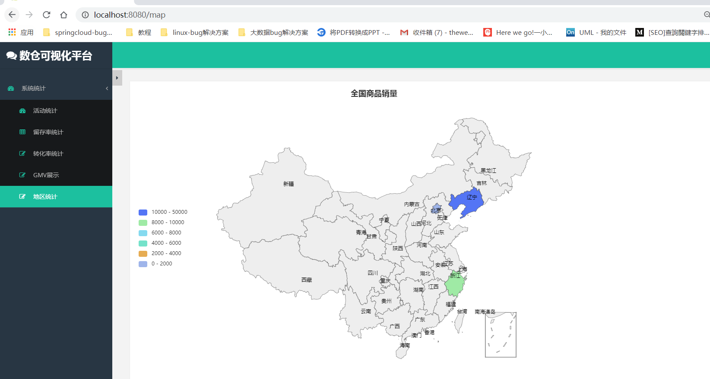
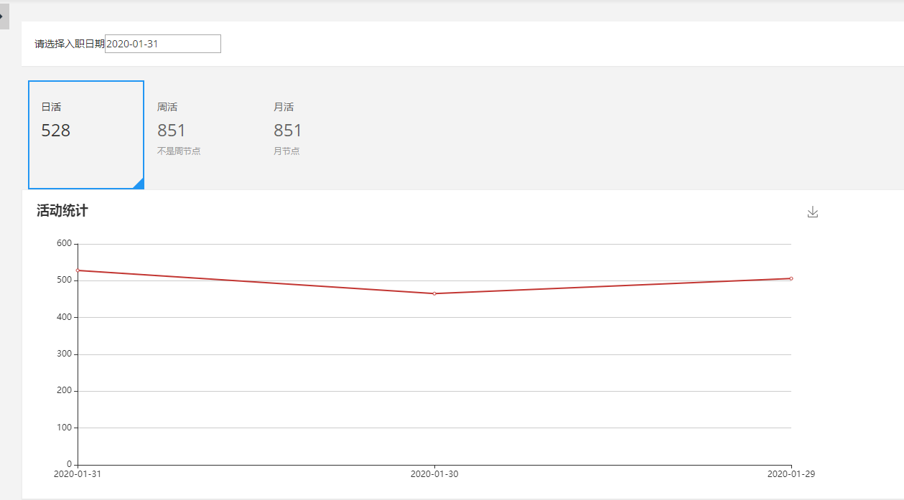
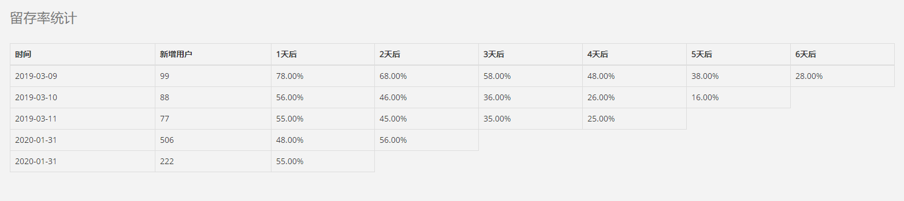
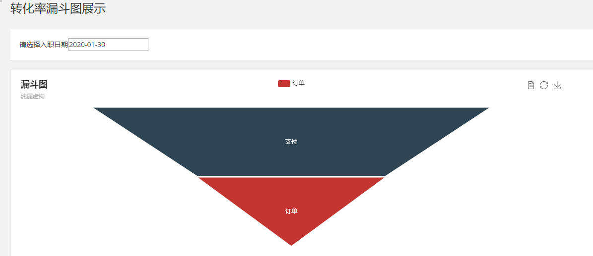
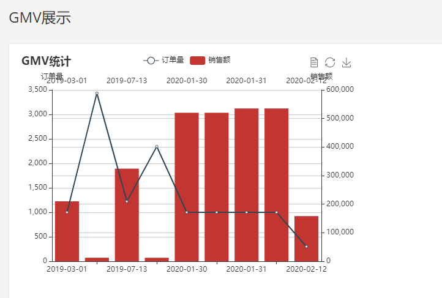
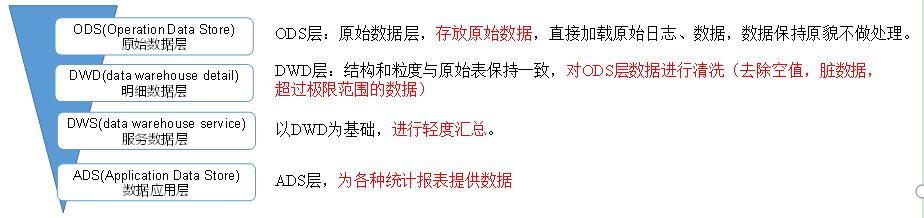

# 电商数仓分析

#### 项目展示

* 活跃度统计

  

* 留存率

  

* 转化率

  

* GMV(销量总额)

  

## 1.需求分析

* 数据采集平台搭建
* 实现用户行为数据仓库的分层搭建
* 实现业务数据仓库的分层搭建
* 针对仓库中的数据进行，留存率，转化率，GMV，复购率，活跃等报表分析

## 2. 技术选型

* 数据采集传输：Flume，Kafka ，Sqoop
* 数据存储：Mysql，HDFS
* 数据计算：Hive，Tez
* 数据查询：Presto

## 3. 系统流程设计

## 4. 框架版本型号

## 5. 集群资源规划

## 6. 数据采集

数据采集是将日志文件用 flume-kafka-flume这样的方式上传到HDFS中

### 6.1  日志采集

ETL拦截器主要用于，过滤时间戳不合法和Json数据不完整的日志。

### 6.2 日志消费

## 7. 用户行为数据仓库

数据仓库分为四层

会将HDFS上的数据导入到Hive中，在Hive中对数据进行处理，分析日活，转化率，用户留存等指标。

## 8.系统业务数据仓库

用sqoop将mysql中的数据导入到HDFS中，再导入到Hive，分析GMV,转化率，复购率等指标，订单表还用到了拉链表，最后使用azkaban全流程调度

## 9. 即席查询

presto

