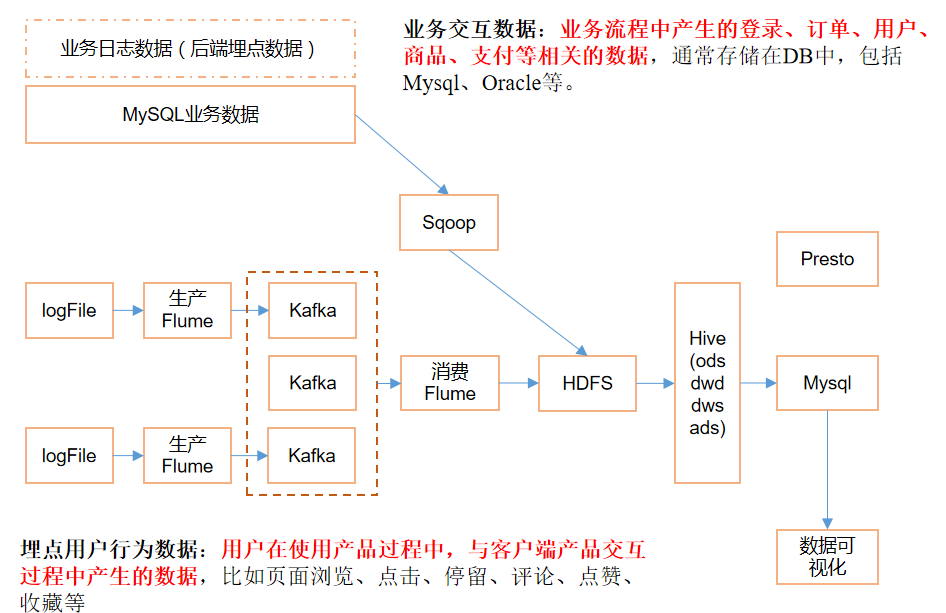
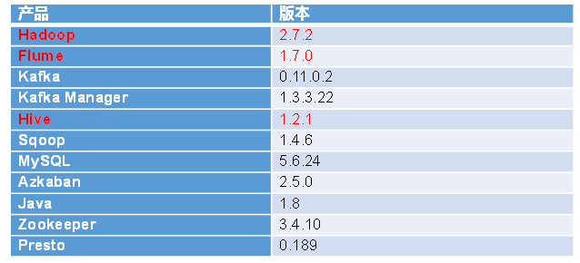
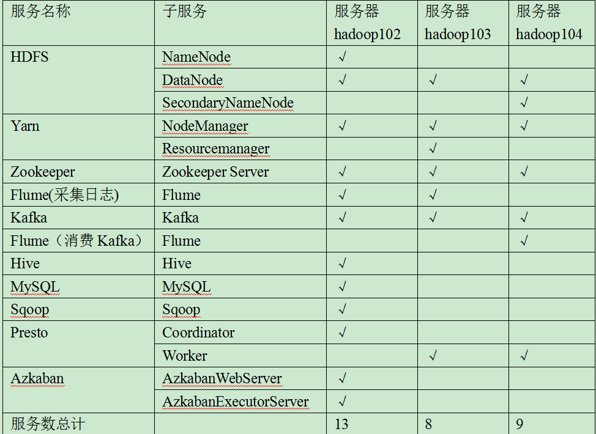
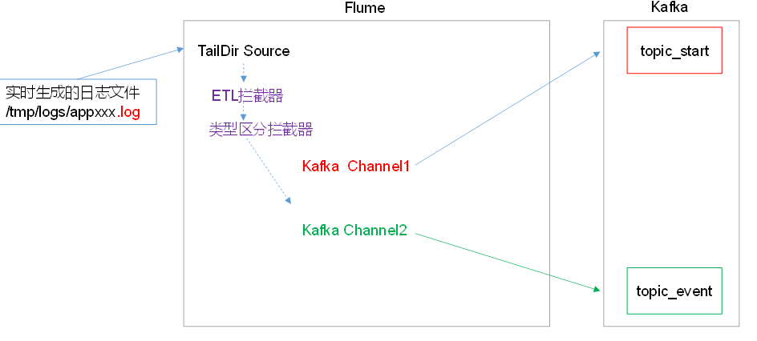
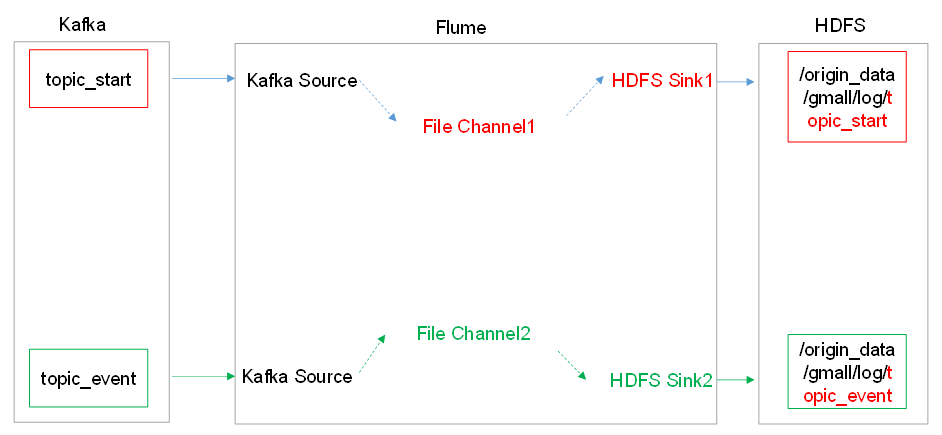

# 电商数仓分析

## 1.需求分析

* 数据采集平台搭建
* 实现用户行为数据仓库的分层搭建
* 实现业务数据仓库的分层搭建
* 针对仓库中的数据进行，留存率，转化率，GMV，复购率，活跃等报表分析

## 2. 技术选型

* 数据采集传输：Flume，Kafka ，Sqoop
* 数据存储：Mysql，HDFS
* 数据计算：Hive，Tez
* 数据查询：Presto

## 3. 系统流程设计

## 4. 框架版本型号

## 5. 集群资源规划

## 6.  日志采集

ETL拦截器主要用于，过滤时间戳不合法和Json数据不完整的日志。

## 7. 日志消费

